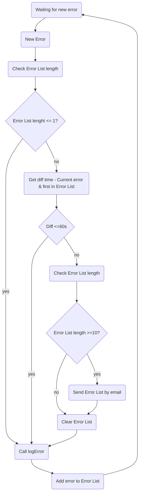

# Exercise

Suppose we have a web application that runs on a single server. Errors that
occur from time to time during normal operation of the application are logged to a
text file that is stored in the file system on the server.
We are not concerned about these errors when their frequency is low. However,
when lots of errors occur in a short period of time, there may be a problem with
the application and we want to be notified immediately. Specifically, when more
than ten errors occur in one minute, we want to receive an email notification.
In general terms or pseudo code, how would you implement such an alarm?

Please assume:

1. The general paradigm of logging errors to a text file will be kept in place.

2. There exists a function

```javascript
function logError( error )
```

This function is called each time there is an error and appends the error to
the end of the log file.

3. We never want to receive more than one email notification per minute.

# Solution

The following flow chart represent the Error Alarm exercise solution.


